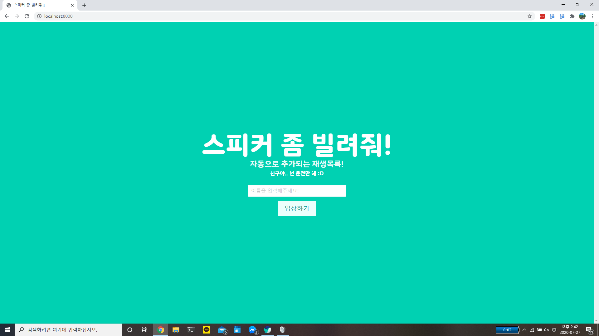
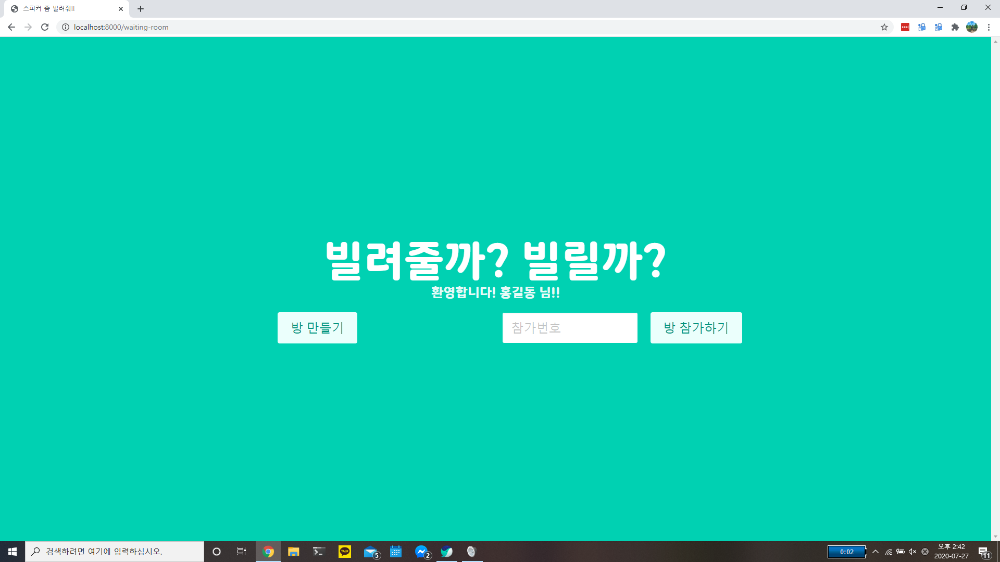
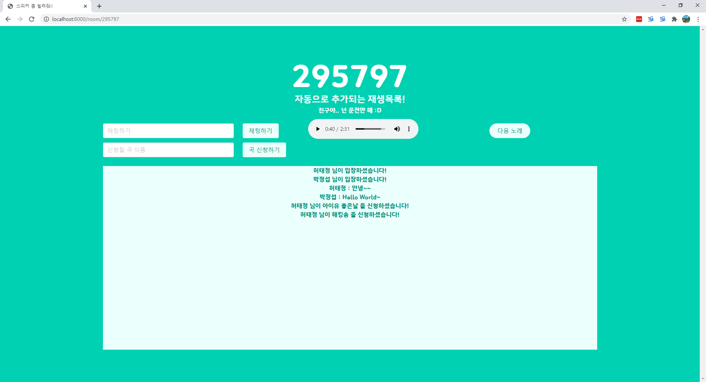
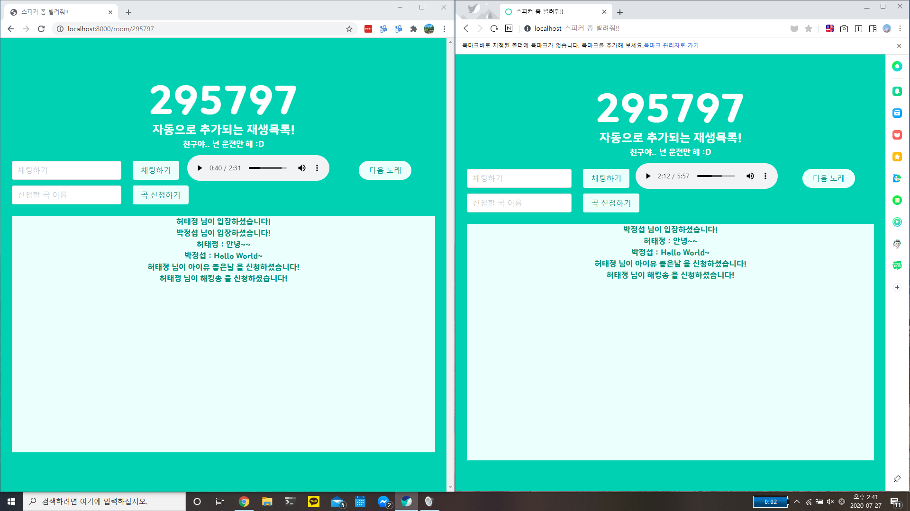

# 🔊스피커좀 빌려줘

#### 멋쟁이사자처럼 연합해커톤 
###### 무지7ㅐ톤 (무작정지르고본 7개학교 연합해커톤)
+ 일시 : 7/25 ~ 7/26 
+ 주제 : 자유  

#### 컨셉
공유 플레이리스트, 라디오 서비스

# 기능

## 처음 화면 - 닉네임 설정
+ 채팅에 사용되는 닉네임 설정


## 방생성, 방참가
+ 방을 생성하거나 이미 생성된 방에 입장


## 방
+ 방에 접속시 방에 현재 설정된 플레이리스트에 맞게 음원재생
+ 방에 있는 사람들과 채팅
+ 플레이리스트에 음원이름을 입력하여 추가





#### 공부한 내용들
+ Fast API
+ WebSocket
+ Youtube API

## 설치
```shell
pip install -r requirements.txt
```

## 백엔드 서버 실행
```shell
uvicorn app.main:app --reload
```

## :busts_in_silhouette:팀원
 - 박정섭 [@ParkJeongseop](https://github.com/ParkJeongseop) (기획자, 개발자)
 - 허태정 [@Aqudi](https://github.com/Aqudi) (개발자)
 - 이강호 [@deserve82](https://github.com/deserve82) (개발자)
 
